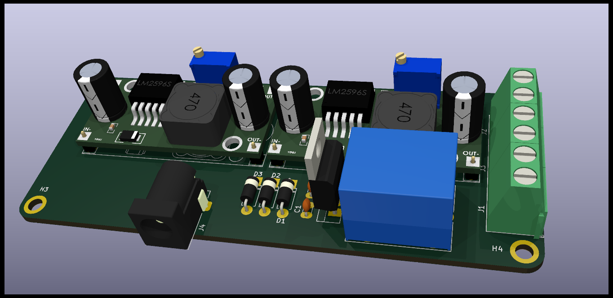
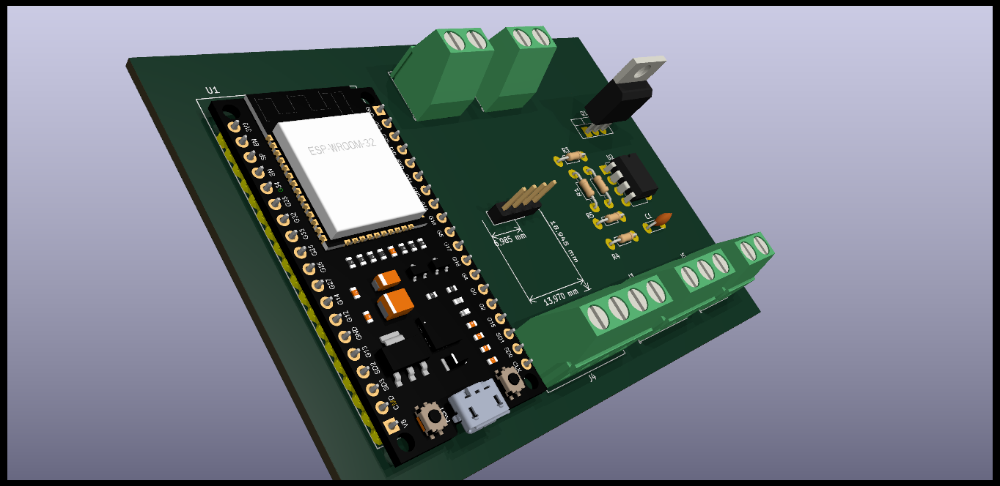

# kicad-libs

useful kicad components

## components

<table>
    <thead style='display:none;'>
    </thead>
    <tbody>
        <tr>
            <td>
                <pre>
📦connectors
┣ 📂3dmodels
┃ ┗ 📂JACK.3dshapes
┃   ┗ 📜JACK_PTH
┣ 📂footprints
┗ 📂symbols
            </pre>
        </td>
        <td>
            <pre>
📦power
 ┣ 📂3dmodels
 ┃ ┗ 📂StepDown.3dshapes
 ┃   ┣ 📜StepDown_LM2596
 ┃   ┗ 📜StepDown_LM2596_PinHeaders
 ┣ 📂footprints
 ┃ ┗ 📂StepDown.pretty
 ┃   ┗ 📜StepDown_LM2596
 ┗ 📂symbols
   ┗ 📜StepDown_LM2596
                </pre>
            </td>
        </tr>
        <tr>
            <td>
                <pre>
📦sensors
 ┣ 📂3dmodels
 ┃ ┗ 📂MPX.3dshapes
 ┃   ┣ 📜MPX2010DP
 ┃   ┗ 📜MPX5700AP
 ┣ 📂footprints
 ┃ ┣ 📂MPS20N0040D.pretty
 ┃ ┃ ┗ 📜MPS20N0040D-module
 ┃ ┗ 📂MPX.pretty
 ┃   ┣ 📜MPX100DP
 ┃   ┗ 📜MPX5700AP
 ┗ 📂symbols
   ┣ 📜MPS20N0040D-module
   ┗ 📜MPX5700AP
                </pre>
            </td>
            <td>
                <pre>
📦modules
 ┣ 📂3dmodels
 ┃ ┣ 📂ADS1115.3dshapes
 ┃ ┃ ┗ 📜ADS1115
 ┃ ┗ 📂MicroSD.3dshapes
 ┃   ┣ 📜MicroSD-mini-pins
 ┃   ┣ 📜MicroSD-mini
 ┃   ┗ 📜MicroSD
 ┣ 📂footprints
 ┃ ┣ 📂ADS1115.pretty
 ┃ ┃ ┗ 📜ADS1115
 ┃ ┗ 📂MIcroSD.pretty
 ┃   ┗ 📜MicroSD
 ┗ 📂symbols
   ┣ 📜ADS1115
   ┗ 📜MicroSD
                </pre>
            </td>
        </tr>
        <tr>
            <td>
                <pre>
📦espressif
 ┣ 📂3dmodels
 ┃ ┣ 📂ESP32-v1.3dshapes
 ┃ ┃ ┗ 📜ESP32-DevKit-v1
 ┃ ┣ 📂ESP8266.3dshapes
 ┃ ┃ ┣ 📜ESP-07v2
 ┃ ┃ ┣ 📜ESP-12
 ┃ ┃ ┣ 📜ESP-12E
 ┃ ┃ ┣ 📜ESP-13-wroom-02
 ┃ ┃ ┗ 📜ESP8266-NodeMCU
 ┃ ┗ 📂Espressif.3dshapes
 ┃   ┣ 📜ESP32-C3-MINI-1
 ┃   ┣ 📜ESP32-C3-WROOM-02
 ┃   ┣ 📜ESP32-DevKitC
 ┃   ┣ 📜ESP32-MINI-1
 ┃   ┣ 📜ESP32-S2-MINI-1
 ┃   ┣ 📜ESP32-S2-WROOM
 ┃   ┣ 📜ESP32-S2-WROVER
 ┃   ┣ 📜ESP32-S3-MINI-1
 ┃   ┣ 📜ESP32-S3-WROOM-1
 ┃   ┣ 📜ESP32-WROOM-32E_No-Cover
 ┃   ┗ 📜ESP32-WROVER-E
 ┣ 📂footprints
 ┃ ┣ 📂ESP32-v1.pretty
 ┃ ┃ ┗ 📜ESP32-DevKit_v1
 ┃ ┣ 📂ESP8266.pretty
 ┃ ┃ ┣ 📜ESP-01
 ┃ ┃ ┣ 📜ESP-03
 ┃ ┃ ┣ 📜ESP-06
 ┃ ┃ ┣ 📜ESP-07S
 ┃ ┃ ┣ 📜ESP-07v2
 ┃ ┃ ┣ 📜ESP-12
 ┃ ┃ ┣ 📜ESP-13-WROOM-02
 ┃ ┃ ┣ 📜ESP-201
 ┃ ┃ ┣ 📜NodeMCU-LoLinV3
 ┃ ┃ ┗ 📜NodeMCU1.0(12-E)
 ┃ ┗ 📂Espressif.pretty
 ┃   ┣ 📜ESP12F-Devkit-V3
 ┃   ┣ 📜ESP32-C3-MINI-1
 ┃   ┣ 📜ESP32-C3-WROOM-02
 ┃   ┣ 📜ESP32-DevKitC
 ┃   ┣ 📜ESP32-MINI-1
 ┃   ┣ 📜ESP32-PICO-MINI-02
 ┃   ┣ 📜ESP32-S2-DevKitM
 ┃   ┣ 📜ESP32-S2-MINI-1
 ┃   ┣ 📜ESP32-S2-SOLO
 ┃   ┣ 📜ESP32-S2-Saola-1
 ┃   ┣ 📜ESP32-S2-WROOM
 ┃   ┣ 📜ESP32-S2-WROVER
 ┃   ┣ 📜ESP32-S3-DevKitC
 ┃   ┣ 📜ESP32-S3-MINI-1
 ┃   ┣ 📜ESP32-S3-WROOM-1
 ┃   ┣ 📜ESP32-S3-WROOM-2
 ┃   ┣ 📜ESP32-WROOM-32E
 ┃   ┣ 📜ESP32-WROOM-DA
 ┃   ┗ 📜ESP32-WROVER-E
 ┗ 📂symbols
   ┣ 📜ESP32-DevKit-v1
   ┣ 📜ESP8266
   ┗ 📜Espressif
                </pre>
            </td>
        </tr>
    </tbody>
</table>

## buck converter and barrel jack

## ESP32 38 pins

